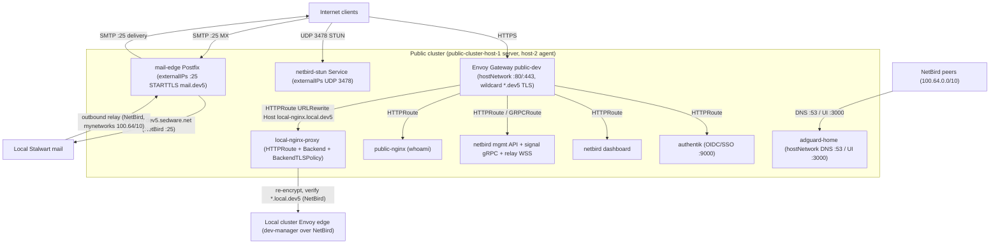

# Public Dev application architecture

The public cluster is the Internet edge. **Envoy Gateway** (standalone,
`gateway.envoyproxy.io` v1.8.2) is the public HTTP/HTTPS/gRPC/WebSocket edge: a
`hostNetwork` DaemonSet on both public nodes with `ipFamily: DualStack`, binding
`:80`/`:443` for IPv4 **and** IPv6, terminating the Dev wildcard certificate from
cert-manager and forwarding accepted HTTPRoutes/GRPCRoutes to IPv4 ClusterIP
services. No HAProxy, Traefik, HTTP NodePort, Kubernetes Ingress or host proxy
is in this path.

The control plane is intentionally not highly available:
`public-cluster-host-1` is the k3s server and `public-cluster-host-2` is an
agent. Both are Envoy Gateway and workload nodes. Cilium provides CNI, kube-proxy
replacement, service load balancing (`externalIPs` announcement) and
CiliumNetworkPolicy; Envoy Gateway is the L7 edge. The Cilium datapath is
IPv4-only; only the Envoy edge accepts external IPv6.

Public HTTP/gRPC/WebSocket services on Envoy Gateway: Authentik (public OIDC
provider), the NetBird dashboard, management API, signal gRPC and relay WebSocket
endpoints, and a stateless `public-nginx` test app that proves the edge
(IPv4/IPv6, TLS, HTTP/2, routing, logs, policy).

Non-HTTP protocols get their own protocol-specific paths, never Envoy:

- **Mail Edge / MX Relay** (`mail-edge`) — the only public SMTP entry and the
  only outbound path; a Cilium Service on `:25` with `externalIPs`. Internet ↔
  Mail Edge ↔ local Stalwart. No user-login ports are public.
- **NetBird STUN/TURN** — UDP `3478` via an explicit Cilium Service.
- **AdGuard** DNS/UI — **NetBird-internal only**, no public route and no public
  DNS; it serves the NetBird DNS group.

All namespaces use CiliumNetworkPolicy with default-deny. Public web apps admit
ingress only from the Envoy Gateway proxy pods; because those proxies run
`hostNetwork` on the dedicated gateway nodes, Cilium identifies them as
`host`/`remote-node`, so app policies allow `fromEntities: [host, remote-node]`
(replacing the former Cilium reserved `ingress` identity). CrowdSec agents send
decisions to the central local LAPI over NetBird; the node nftables firewall
bouncer is the edge block.

Only Dev domains are active. Production hostnames are not rendered or routed.

## Request paths

