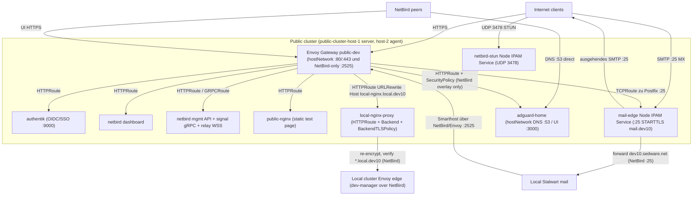

# Public Dev application architecture

> **Canonical platform/edge architecture:** the k3s control plane, Cilium
> datapath, the standalone Envoy Gateway edge (hostNetwork DaemonSet, DualStack
> `:80`/`:443`, TLS termination, IPv6 handling) and the firewall/CrowdSec model
> are described **once** in
> [`public-cluster-nix/docs/architecture.md`](https://github.com/rowBeeX/public-cluster-nix/blob/main/docs/architecture.md).
> This file only covers the **application** layer that lives in this repo — which
> apps sit behind that edge and how they are routed (#36).

The public cluster is the Internet edge. This repo owns the workloads on top of
the platform: the HTTP apps routed by Envoy Gateway, the non-HTTP protocol paths,
and the per-namespace CiliumNetworkPolicies.

Public HTTP/gRPC/WebSocket services on Envoy Gateway: Authentik (public OIDC
provider), the NetBird dashboard, management API, signal gRPC and relay WebSocket
endpoints, and a stateless `public-nginx` test app that proves the edge
(IPv4/IPv6, TLS, HTTP/2, routing, logs, policy).

Non-HTTP protocols get their own protocol-specific paths, never Envoy:

- **Mail Edge / MX Relay** (`mail-edge`) — öffentlicher SMTP-Eingang als Cilium
  Node IPAM Service auf `:25`. Eingehend läuft Internet → Mail Edge →
  lokales Stalwart. Ausgehend nutzt Stalwart den NetBird-only-Envoy-Listener
  `:2525`, dessen TCPRoute zu Mail Edge `:25` führt. Postfix vertraut nur dem
  einzelnen PodCIDR von Gateway-Node 1; Cilium lässt dafür ausschließlich die
  Host-/Remote-Node-Identity durch. Fremde Quellen können ausschließlich lokale
  Empfänger adressieren. Es sind keine User-Login-Ports öffentlich.
- **NetBird STUN/TURN** — UDP `3478` via an explicit Cilium Service.
- **AdGuard** DNS/UI — **NetBird-internal only**: no public DNS, and the UI's
  Envoy route is locked to the NetBird overlay by a `SecurityPolicy`, so it never
  faces the internet. AdGuard serves the NetBird DNS group.

All namespaces that run pods use CiliumNetworkPolicy with default-deny (pod-less
route-only namespaces such as `app-local-nginx-proxy` carry none). Public web apps admit
ingress only from the Envoy Gateway proxy pods; because those proxies run
`hostNetwork` on the dedicated gateway nodes, Cilium identifies them as
`host`/`remote-node`, so app policies allow `fromEntities: [host, remote-node]`.

Only Dev domains are active. Production hostnames are not rendered or routed.

## Request paths

