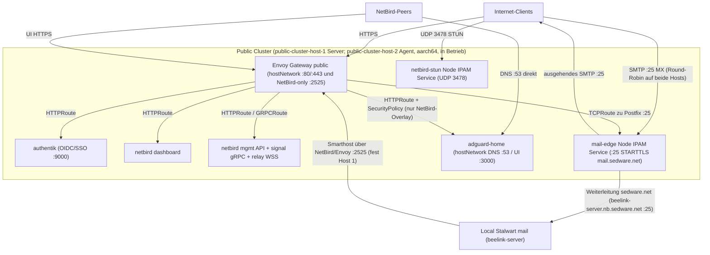

# Public-Applikationsarchitektur

> **Kanonische Plattform-/Edge-Architektur:** die k3s-Control-Plane, der
> Cilium-Datapath, der eigenständige Envoy-Gateway-Edge (hostNetwork-
> DaemonSet, DualStack `:80`/`:443`, TLS-Terminierung, IPv6-Handling) und das
> Firewall-/CrowdSec-Modell sind **einmalig** beschrieben in
> [`public-cluster-nix/docs/architecture.md`](https://github.com/rowBeeX/public-cluster-nix/blob/main/docs/architecture.md).
> Diese Datei deckt nur die **Applikationsschicht** ab, die in diesem Repo
> liegt — welche Apps hinter diesem Edge sitzen und wie sie geroutet werden.

Der Public-Cluster ist der Internet-Edge. Dieses Repo besitzt die Workloads
oberhalb der Plattform: die per Envoy Gateway gerouteten HTTP-Apps, die
Non-HTTP-Protokollpfade und die CiliumNetworkPolicies je Namespace.

Öffentliche HTTP/gRPC/WebSocket-Dienste am Envoy Gateway: Authentik
(öffentlicher OIDC-Provider, `authentik.sedware.net`), das NetBird-Dashboard
(`netbird.sedware.net`) sowie die NetBird-Management-API, Signal-gRPC- und
Relay-WebSocket-Endpunkte (`netbird-control.sedware.net`). Am Apex
`sedware.net` liefert `mail-wellknown` genau einen Exact-Match-Pfad
(`/.well-known/autoconfig/mail/config-v1.1.xml`), nur am HTTPS-Listener.

Ohne eigene Route, aber ebenfalls hier: `alloy` schiebt Telemetrie in den
lokalen Cluster und `gitlab-runner` holt CI-Jobs vom dortigen GitLab — beide
ausschließlich als Egress über das NetBird-Overlay, kein Internet-Ingress.

Non-HTTP-Protokolle bekommen eigene, protokollspezifische Pfade, nie Envoy:

- **Mail Edge / MX Relay** (`mail-edge`) — öffentlicher SMTP-Eingang als Cilium
  Node IPAM Service auf `:25`. Eingehend läuft Internet → Mail Edge →
  lokales Stalwart; das nehmen **beide** Gateway-Nodes an, weil die A/AAAA-
  Records von `mail.sedware.net` im Round-Robin auf beide Public-Hosts zeigen
  und je Node ein mail-edge-Pod läuft. Ausgehend nutzt Stalwart den
  NetBird-only-Envoy-Listener `:2525`, dessen TCPRoute zu Mail Edge `:25` führt;
  dieser Weg zielt auf einen **festen Einzel-Peer**
  (`public-cluster-host-1.nb.sedware.net`) und ist damit nicht redundant — ein
  Ausfall von Host 1 stoppt ihn, bis `MAIL_RELAY_HOST` umgestellt wird
  (bekannter offener Punkt, siehe `apps/mail-edge/README.md`). Postfix vertraut
  den PodCIDRs beider Gateway-Nodes (`10.42.0.0/24` und `10.42.1.0/24`); genutzt
  wird davon derzeit nur das von Host 1, `10.42.1.0/24` steht dort vorsorglich
  für ein Umschwenken. Cilium lässt dafür ausschließlich die Host-/Remote-Node-
  Identity durch. Fremde Quellen können ausschließlich lokale Empfänger
  adressieren. Es sind keine User-Login-Ports öffentlich.
- **NetBird STUN/TURN** — UDP `3478` über einen expliziten Cilium Service.
- **AdGuard** DNS/UI — **ausschließlich NetBird-intern**: kein öffentliches
  DNS, und die Envoy-Route der UI ist per `SecurityPolicy` auf das NetBird-
  Overlay begrenzt, sodass sie nie dem Internet zugewandt ist. AdGuard bedient
  die NetBird-DNS-Gruppe.

Jeder App-Namespace nutzt CiliumNetworkPolicy mit Default-Deny. Öffentliche
Web-Apps lassen Ingress nur von den Envoy-Gateway-Proxy-Pods zu; da diese
Proxies `hostNetwork` auf den dedizierten Gateway-Nodes fahren, identifiziert
Cilium sie als `host`/`remote-node`, weshalb die App-Policies
`fromEntities: [host, remote-node]` erlauben.

Es gibt genau eine Umgebung. Alle öffentlichen Hostnamen liegen unter
`sedware.net`.

## Request-Pfade

```mermaid
flowchart TB
  internet["Internet-Clients"]
  nbpeers["NetBird-Peers"]
  stalwart["Local Stalwart mail (beelink-server)"]

  subgraph public["Public Cluster (public-cluster-host-1 Server; public-cluster-host-2 Agent, aarch64, in Betrieb)"]
    envoy["Envoy Gateway public (hostNetwork :80/:443 und NetBird-only :2525)"]
    authentik["authentik (OIDC/SSO :9000)"]
    nbdash["netbird dashboard"]
    nbmgmt["netbird mgmt API + signal gRPC + relay WSS"]
    stunsvc["netbird-stun Node IPAM Service (UDP 3478)"]
    mailedge["mail-edge Node IPAM Service (:25 STARTTLS mail.sedware.net)"]
    adguard["adguard-home (hostNetwork DNS :53 / UI :3000)"]
  end

  internet -->|HTTPS| envoy
  envoy -->|HTTPRoute| authentik
  envoy -->|HTTPRoute| nbdash
  envoy -->|HTTPRoute / GRPCRoute| nbmgmt

  internet -->|UDP 3478 STUN| stunsvc
  internet -->|"SMTP :25 MX (Round-Robin auf beide Hosts)"| mailedge
  mailedge -->|"Weiterleitung sedware.net (beelink-server.nb.sedware.net :25)"| stalwart
  stalwart -->|"Smarthost über NetBird/Envoy :2525 (fest Host 1)"| envoy
  envoy -->|"TCPRoute zu Postfix :25"| mailedge
  mailedge -->|"ausgehendes SMTP :25"| internet

  nbpeers -->|DNS :53 direkt| adguard
  nbpeers -->|UI HTTPS| envoy
  envoy -->|"HTTPRoute + SecurityPolicy (nur NetBird-Overlay)"| adguard
```
